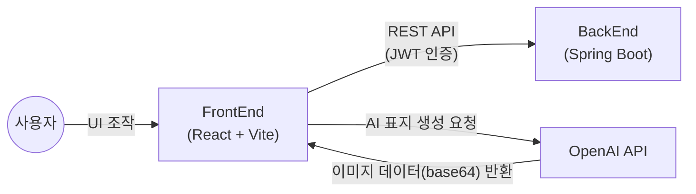

# 도서 관리 시스템

> KT AIVLE School AI 트랙 미니프로젝트 5차 (Frontend)


## 프로젝트 소개

- 누구나 작가가 되어 자유롭게 글을 집필하고 공개할 수 있는 창작 플랫폼입니다.
- 회원가입/로그인 후 도서를 등록·수정하고, 다른 작가를 팔로우하며, 댓글과 평점으로 소통할 수 있습니다.
- 작가의 감성과 이야기가 그대로 반영될 수 있도록 AI 표지 생성 기능을 지원합니다.

미니프로젝트 4차의 json-server 목업 버전을 기반으로, 실제 Spring Boot 백엔드(`../BackEnd`)와 통신하도록 전환하고 인증·팔로우·댓글 기능을 추가한 버전입니다.

<br>

## 시스템 아키텍처



<br>

## 주요 기능

### 회원 / 인증
- 회원가입, 로그인, 로그아웃 (JWT 기반)
- 이메일·닉네임 중복 확인

### 도서
- 도서 등록·수정·삭제, 상세 조회, 조회수 집계
- 제목/작가/장르/출판사/가격대 등 상세 검색, 장르별 카테고리 필터링
- 조회수 기준 인기 랭킹, 출판일 기준 신작 랭킹

### AI 표지 생성
- 스타일·배경·조명·타이포그래피 태그 선택 및 프롬프트 입력으로 표지 생성
- 1회 생성에 최대 3가지 샘플 제공, 등록 후에도 언제든 재생성 가능

### 소셜
- 작가 프로필 페이지, 팔로우 / 언팔로우
- 도서별 댓글 작성과 평점(1~5) 등록
- 마이페이지에서 내가 등록한 도서, 즐겨찾기, 팔로우 목록 확인

<br>

## 기술 스택

### Environment
  

### Development
     

### Communication
   

<br>

## 프로젝트 구조

```text
Frontend/
├── public/                  # 정적 파일 (파비콘, 아이콘 등)
├── src/
│   ├── assets/               # 이미지 및 UI 에셋
│   ├── context/
│   │   └── AuthContext.jsx   # 로그인 상태 전역 관리
│   ├── components/
│   │   ├── auth/              # 로그인, 회원가입
│   │   ├── common/            # Header, 상세 검색 패널
│   │   ├── detail/             # 도서 상세 정보
│   │   ├── edit/               # 도서 등록/수정, AI 표지 에디터
│   │   ├── list/                # 도서 목록, 마이페이지
│   │   ├── main/                # 메인 화면, 검색바
│   │   └── pages/               # Home, 작가 프로필 페이지
│   ├── util/
│   │   └── bookCoverService.js  # AI 표지 생성 API 연동
│   ├── App.jsx               # 라우터
│   └── main.jsx               # React 진입점
└── .env                      # 환경 변수 (VITE_API_BASE_URL, VITE_OPENAI_API_KEY)
```

<br>

## 설치 및 실행

### 사전 요구사항
- Node.js / npm
- 실행 중인 백엔드 서버 (`../BackEnd` 참고)

### 환경 변수

프로젝트 루트에 `.env` 파일 생성:
```
VITE_API_BASE_URL=http://localhost:8080
VITE_OPENAI_API_KEY=
```

### 실행

```sh
npm install
npm run dev
```

<br>

## 화면 구성

|메인 화면 |도서 목록 |
|--------|--------|
| | |
|도서 검색 기능과 도서 랭킹 제공 |사이드바에서 장르별 모아보기 기능 |
|신규 도서 등록|도서 표지 생성|
| | |
|제목, 저자, 내용 등 정보 입력 |태그와 프롬프트를 입력하여 원하는 AI 표지 생성 |
|도서 상세 정보|AI 표지 수정|
| | |
|등록한 도서 정보 내용 출력 |표지 수정도 생성 시와 동일 |

<br>

## 팀원 및 R&R

| 이름 | 역할 | 담당 기능 |
|------|------|-----------|
| 박태정 | 조장 | PM·기획, AI/Frontend 연동 |
| 김다진 | PPT | 백엔드 개발 |
| 황민서 | 검토담당자 | 백엔드 개발 |
| 배수성 | 타임키퍼 | 백엔드 개발 |
| 유지은 | 발표자 | 백엔드 개발 |
| 이채은 | 서기 | AI/Frontend 연동 |
| 김다애 | PPT | 통합/예외 처리 |
| 김경민 | - | 예비군 훈련으로 대부분 불참, 백엔드 일부 참여 |
