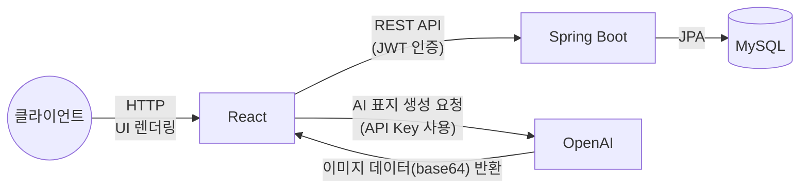

# 도서 관리 시스템 — Full Stack

> KT AIVLE School AI 트랙 미니 프로젝트 5차 | 12조

미니프로젝트 4차(별도 저장소 `04-Miniproject`)에서 json-server 목업으로 만들었던 도서 관리 시스템 프론트엔드를, 실제 **Spring Boot + MySQL 백엔드**로 전환하고 회원가입/로그인/팔로우/댓글·평점 같은 실사용 기능을 추가한 풀스택 프로젝트입니다.

<br>

## 아키텍처



- **Before(4차, json-server 목업) → After(5차, 실 백엔드)** 전환 과정과 상세 ERD·API·트러블슈팅은 [BackEnd/README.md](./BackEnd/README.md)에 정리돼 있습니다.

<br>

## 구성

| 디렉토리 | 내용 |
|---|---|
| [`Frontend/`](./Frontend) | React + Vite. 도서 목록/상세/등록, AI 표지 생성, 회원가입·로그인, 마이페이지, 작가 프로필·팔로우 |
| [`BackEnd/`](./BackEnd) | Spring Boot + MySQL + JPA + Spring Security(JWT). 회원/도서/댓글/팔로우/즐겨찾기 REST API |

각 디렉토리의 README에 세부 기술 스택, 프로젝트 구조, API 엔드포인트, 실행 방법, 화면 미리보기, 트러블슈팅이 정리돼 있습니다.

<br>

## 팀 R&R

| 이름 | 역할 | 담당 기능 |
|------|------|-----------|
| 박태정 | 조장 | PM·기획, AI/Frontend 연동 |
| 김다진 | PPT | 백엔드 개발 |
| 황민서 | 검토담당자 | 백엔드 개발 |
| 배수성 | 타임키퍼 | 백엔드 개발 |
| 유지은 | 발표자 | 백엔드 개발 |
| 이채은 | 서기 | AI/Frontend 연동 |
| 김다애 | PPT | 통합/예외 처리 |

<br>

## 빠른 시작

```bash
# MySQL에 book_db 데이터베이스 생성 후

# Backend
cd BackEnd/book-backend
# IntelliJ에서 BookBackendApplication.java 실행 (또는 ./gradlew bootRun)

# Frontend
cd Frontend
npm install
npm run dev
```

환경 변수 등 자세한 설치 방법은 [BackEnd/README.md](./BackEnd/README.md#설치-및-실행-방법)를 참고하세요.
